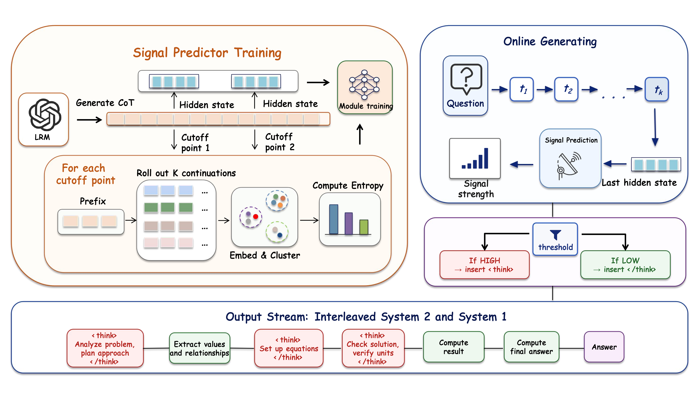
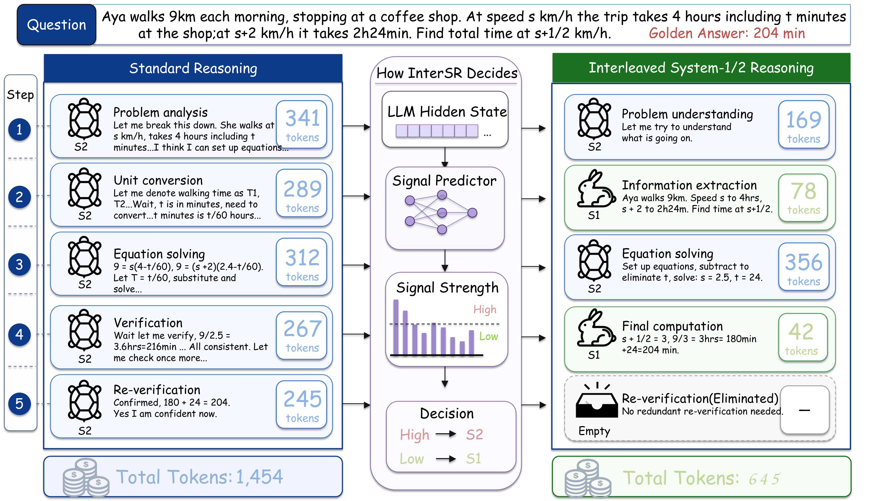

# InterSR: Interleaved System-1/2 Reasoning

## Overview

We propose **Interleaved System-1/2 Reasoning (InterSR)**, a cognitively inspired framework that dynamically alternates between System 1 (fast, intuitive) and System 2 (slow, deliberate) reasoning modes during generation. Central to InterSR is a learnable switching signal that reflects the necessity for deeper reasoning at each step, enabling fine-grained control over cognitive mode transitions. This signal is predicted directly from the model's internal hidden states and allows real-time reasoning modulation **without modifying model parameters**.



## Case Study

Comparison between InterSR and Standard methods on the same problem:



## Project Structure

```
InterSR/
├── intersr/                              # Core InterSR package
│   ├── generate.py                       # HuggingFace-based InterSR generation
│   ├── model.py                          # InterSRModel (compatible with model.generate())
│   └── signal_predictor/                 # Signal prediction modules
│       ├── architecture.py               # SentenceSplitMLP & SignalPredictorMLP
│       ├── generate_samples.py           # Step 1: Generate sampled responses
│       ├── compute_signal.py             # Step 2: Compute signal labels
│       ├── prepare_data.py               # Step 3: Prepare training data
│       └── train.py                      # Step 4: Train MLP modules
├── serving/                              # SGLang high-throughput serving
│   ├── qwen2_intersr.py                  # InterSR-augmented Qwen2 for SGLang
│   └── llama_intersr.py                  # InterSR-augmented Llama for SGLang
├── evaluation/                           # Evaluation scripts
│   ├── math_eval.py                      # Math benchmarks (GSM8K, MATH500, etc.)
│   ├── mcqa_eval.py                      # Multiple-choice QA (MMLU, ARC, GPQA)
│   └── code_eval.py                      # Code generation (HumanEval)
├── configs/                              # Evaluation configurations
│   ├── gsm8k.yaml                        # GSM8K config
│   ├── math500.yaml                      # MATH500 config
│   ├── aime24.yaml                       # AIME 2024 config
│   └── amc23.yaml                        # AMC 2023 config
├── ISR.png                               # Model architecture figure
├── Case.png                              # Case study figure
├── setup.py                              # Package setup
├── requirements.txt                      # Dependencies
├── LICENSE                               # MIT License
├── .gitignore
└── README.md
```

## Installation

```bash
pip install -r requirements.txt
```

## Quick Start

### 1. Download Models

Download the base models from HuggingFace and place them in the `model/` directory:

```
model/
└── Qwen/
    ├── DeepSeek-R1-Distill-Qwen-1.5B/
    ├── DeepSeek-R1-Distill-Qwen-7B/
    └── DeepSeek-R1-Distill-Qwen-14B/
```

### 2. Train Signal Predictor Modules

InterSR requires two lightweight MLP modules trained on the base model's hidden states:

```bash
# Step 1: Generate sampled responses for signal estimation
python intersr/signal_predictor/generate_samples.py

# Step 2: Compute signal labels via embedding-based clustering
python intersr/signal_predictor/compute_signal.py --model-name DeepSeek-R1-Distill-Qwen-7B

# Step 3: Prepare training data (extract hidden states + labels)
python intersr/signal_predictor/prepare_data.py

# Step 4: Train SentenceSplitMLP and SignalPredictorMLP
python intersr/signal_predictor/train.py
```

The trained MLP weights will be saved to `intersr/signal_predictor/output/{model_name}/`.

## Inference

InterSR supports two inference modes: **HuggingFace Transformers** (single-GPU, easy to use) and **SGLang** (high-throughput serving with batched requests).

### Option A: HuggingFace Inference

Use `intersr/generate.py` for straightforward single-GPU inference:

```python
from intersr.generate import custom_generate, load_models_and_mlps

# Load base model + InterSR signal predictor modules
model, tokenizer, sentence_split_mlp, signal_predictor_mlp = load_models_and_mlps(
    model_path="model/Qwen/DeepSeek-R1-Distill-Qwen-7B",
    sentence_split_path="intersr/signal_predictor/output/DeepSeek-R1-Distill-Qwen-7B/sentence_split_best.pt",
    signal_predictor_path="intersr/signal_predictor/output/DeepSeek-R1-Distill-Qwen-7B/signal_predictor_best.pt",
    device="cuda:0",
    hidden_size=3584  # 1.5B: 1536, 7B: 3584, 14B: 5120
)

# Prepare input
messages = [{"role": "user", "content": "What is 25 * 37?"}]
text = tokenizer.apply_chat_template(messages, tokenize=False, add_generation_prompt=True)
input_ids = tokenizer([text], return_tensors="pt")["input_ids"].to(model.device)

# Generate with InterSR
generated_ids = custom_generate(
    input_ids, model, sentence_split_mlp, signal_predictor_mlp,
    max_new_tokens=4096,
    temperature=0.6,
    top_p=0.95,
    think_threshold=0.4,   # Signal threshold for mode switching
    min_think_tokens=10,   # Min tokens before exiting think mode
    min_normal_tokens=10,  # Min tokens before entering think mode
    flag=1                 # Start in thinking mode (1) or normal mode (0)
)

print(tokenizer.decode(generated_ids[0], skip_special_tokens=True))
```

Alternatively, use the `InterSRModel` wrapper which is compatible with HuggingFace's `model.generate()`:

```python
from intersr.model import InterSRModel

model = InterSRModel.from_pretrained(
    "model/Qwen/DeepSeek-R1-Distill-Qwen-7B",
    "intersr/signal_predictor/output/DeepSeek-R1-Distill-Qwen-7B/sentence_split_best.pt",
    "intersr/signal_predictor/output/DeepSeek-R1-Distill-Qwen-7B/signal_predictor_best.pt",
    hidden_size=3584,
    think_threshold=0.4,
)

# Works with standard generate() API
output = model.generate(
    input_ids,
    max_new_tokens=4096,
    temperature=0.6,
    top_p=0.95,
    do_sample=True,
    initial_mode=1,  # Start in thinking mode
)
```

### Option B: SGLang Inference (High-Throughput Serving)

For high-throughput serving with batched requests, InterSR integrates with [SGLang](https://github.com/sgl-project/sglang).

**Step 1: Create an InterSR model directory**

```bash
python serving/qwen2_intersr.py --create-model \
    --base-model model/Qwen/DeepSeek-R1-Distill-Qwen-7B \
    --split-mlp intersr/signal_predictor/output/DeepSeek-R1-Distill-Qwen-7B/sentence_split_best.pt \
    --signal-predictor-mlp intersr/signal_predictor/output/DeepSeek-R1-Distill-Qwen-7B/signal_predictor_best.pt \
    --output-dir model/InterSR-DeepSeek-R1-Distill-Qwen-7B \
    --threshold 0.4
```

This creates a directory with:
- Symlinked base model files
- Copied MLP weights (`sentence_split_mlp.pt`, `signal_predictor_mlp.pt`)
- Modified `config.json` with InterSR settings and `"architectures": ["Qwen2InterSRForCausalLM"]`

**Step 2: Launch the SGLang server**

```bash
# For Qwen-based models
SGLANG_EXTERNAL_MODEL_PACKAGE=serving.qwen2_intersr \
    python -m sglang.launch_server \
    --model-path model/InterSR-DeepSeek-R1-Distill-Qwen-7B \
    --port 30000

# For Llama-based models
SGLANG_EXTERNAL_MODEL_PACKAGE=serving.llama_intersr \
    python -m sglang.launch_server \
    --model-path model/InterSR-DeepSeek-R1-Distill-Llama-8B \
    --port 30000
```

**Step 3: Send requests via the OpenAI-compatible API**

```python
import openai

client = openai.Client(base_url="http://localhost:30000/v1", api_key="none")
response = client.chat.completions.create(
    model="InterSR-DeepSeek-R1-Distill-Qwen-7B",
    messages=[{"role": "user", "content": "Solve: What is 25 * 37?"}],
    max_tokens=4096,
    temperature=0.6,
)
print(response.choices[0].message.content)
```

## Evaluation

### Math Benchmarks

We provide config files for all math benchmarks used in the paper. Datasets are loaded from HuggingFace Hub automatically.

```bash
# GSM8K
python evaluation/math_eval.py --config_file configs/gsm8k.yaml

# MATH500
python evaluation/math_eval.py --config_file configs/math500.yaml

# AIME24
python evaluation/math_eval.py --config_file configs/aime24.yaml

# AMC23
python evaluation/math_eval.py --config_file configs/amc23.yaml
```

### Multiple-Choice QA (MMLU, ARC-Challenge, GPQA)

```bash
python evaluation/mcqa_eval.py --config_file configs/gsm8k.yaml --benchmark arc
python evaluation/mcqa_eval.py --config_file configs/gsm8k.yaml --benchmark mmlu
python evaluation/mcqa_eval.py --config_file configs/gsm8k.yaml --benchmark gpqa
```

### Code Generation (HumanEval)

```bash
python evaluation/code_eval.py \
    --model_path model/Qwen/DeepSeek-R1-Distill-Qwen-7B \
    --method custom_generate \
    --think_threshold 0.4 \
    --hidden_size 3584
```

## Key Hyperparameters

| Parameter | Description | Default |
|-----------|-------------|---------|
| `think_threshold` | Signal threshold for triggering System-2 reasoning | 0.4 |
| `min_think_tokens` | Minimum tokens to generate in thinking mode before switching | 10 |
| `min_normal_tokens` | Minimum tokens to generate in normal mode before switching | 10 |
| `hidden_size` | Hidden dimension of the base model (1.5B: 1536, 7B: 3584, 14B: 5120) | 3584 |

## Supported Models

| Model | Hidden Size |
|-------|------------|
| DeepSeek-R1-Distill-Qwen-1.5B | 1536 |
| DeepSeek-R1-Distill-Qwen-7B | 3584 |
| DeepSeek-R1-Distill-Qwen-14B | 5120 |
| DeepSeek-R1-Distill-Llama-8B | 4096 |
